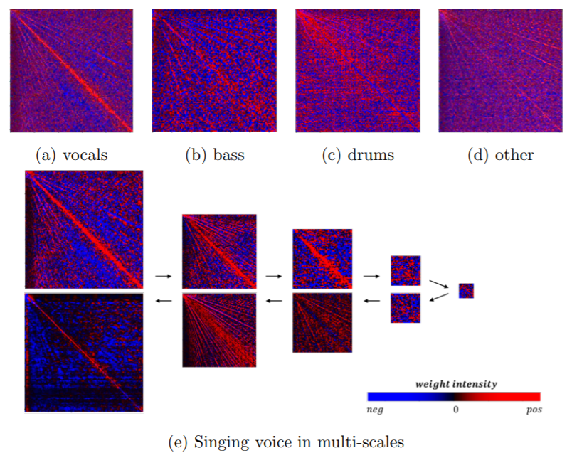
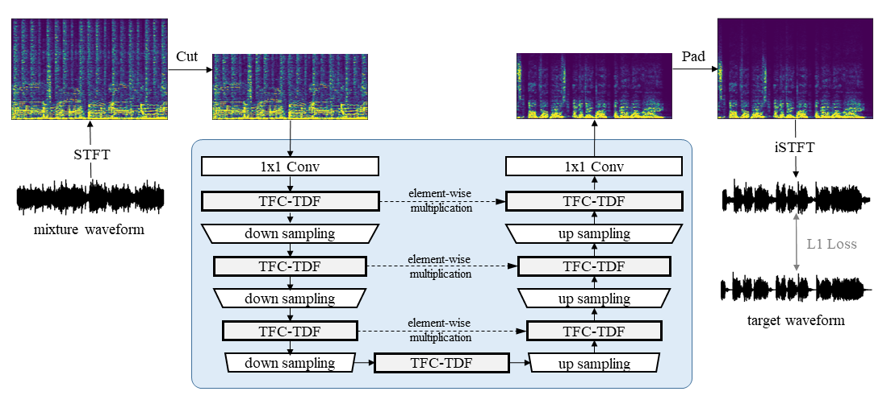

# Summary

Recently, many methods based on deep learning have been proposed for music source separation. Some state-of-the-art methods have shown that stacking many layers with many skip connections improve the SDR performance. Although such a deep and complex architecture shows outstanding performance, it usually requires numerous computing resources and time for training and evaluation.
This paper proposes a two-stream neural network for music demixing, called KUIELab-MDX-Net, which shows a good balance of performance and required resources.
The proposed model has a time-frequency branch and a time-domain branch, where each branch separates stems, respectively. It blends results from two streams to generate the final estimation.
KUIELab-MDX-Net took second place on leaderboard A and third place on leaderboard B in the Music Demixing Challenge at ISMIR 2021. This paper also summarizes experimental results on another benchmark, MUSDB18.

# Introduction

Recently, many methods have been proposed for music source separation.
Notably, deep learning approaches [@densenet:2017; @mmdenselstm:2018; @liu:2019; @choi:2020; @d3net:2021, @defossez:2021] have become mainstream because of their excellent performance.
Some state-of-the-art methods [@densenet:2017; @mmdenselstm:2018; @choi:2020; @d3net:2021] have shown that stacking many layers with many skip connections improve the SDR performance.

Although a deep and complex architecture shows outstanding performance, it usually requires numerous computing resources and time for training and evaluation.
Such disadvantages make them not affordable in a restricted environment where limited resources are provided.
For example, some deep models such as LaSAFT-Net [@choi:2021] exceed the time limit of the Music Demixing Challenge (MDX) at ISMIR 2021 [@mdx:2021] even if they are the current state of the art on the MUSDB18 [@musdb:2017] benchmark.

This paper presents a source separation model named KUIELab-MDX-Net.
We empirically found a good balance of performance and required resources to design KUIElab-MDX-Net.
For example, we replaced channel-wise concatenation operations with simple element-wise multiplications for each skip connection between encoder and decoder (i.e., for each U-connection in U-Net).
In our prior experiments, it reduced parameters with negligible performance degradation.

Also, we removed the other skip connections, especially, skip connections used in dense blocks [@densenet:2017; @mmdenselstm:2018; @choi:2020; @d3net:2021].
We observed that stacked convolutional networks without dense connections followed by Time-Distributed Fully connected layers (TDF) [@choi:2020] could perform comparably to dense blocks without TDFs.
TDF, proposed in [@choi:2020], is a sequence of linear layers. It is applied to a given input in the frequency domain to capture frequency-to-frequency dependencies of the target source.
Since a single TDF block has the whole receptive field in terms of frequency, injecting TDF blocks into a conventional U-Net [@unet:2015] improves the SDR performance on singing voice separation even with a shallower structure.

By introducing such tricks, we found a computationally efficient and effective model design.
As a result, the proposed architecture has a time-frequency branch and a time-domain branch, where each branch separates stems, respectively. It blends results from two streams to generate the final estimation.
KUIELab-MDX-Net took second place on leaderboard A and third place on leaderboard B in the Music Demixing Challenge at ISMIR 2021.
This paper also summarizes experimental results on another benchmark, MUSDB18.

# Background

## Frequency Transformation for Source Separation

Some source separation methods [@phasen:2020; @choi:2020; @choi:phd] have adopted Frequency Transformation (FT) to capture frequency-to-frequency dependencies of the target source.
Both designed their FT blocks with fully connected layers, also known as linear layers. For example, [@choi:2020] proposed Time-Distributed Fully connected layers (TDF) to capture frequency patterns observed in spectrograms of a singing voice.
A TDF block is a sequence of two linear layers. It is applied to a given input in the frequency domain.
The first layer downsamples the features to $\mathbb{R}^{\lceil F/bn \rceil}$, where we denote the number of frequency bins in a given spectrogram feature by $F$ and the bottleneck factor that controls the degree of downsampling by $bn$.

## TFC-TDF-U-Net v1

[@choi:2020] proposed the original TFC-TDF-U-Net for singing voice separation.
We call this architecture TFC-TDF-U-Net v1 for the rest of this paper.
It adopted a Time-Frequency Convolutions followed by a TDF (TFC-TDF) block as a fundamental building block.
By replacing fully connected 2-D convolutional building blocks, conventionally used in U-Net [@unet:2015] with TFC-TDF blocks, it showed a promising performance on singing voice separation tasks of the MUSDB18 [@musdb:2017] dataset.
Also, injecting TDF blocks can enhance separation quality for the other tasks of MUSDB18, as shown in [@choi:phd].

[@choi:phd] presented how adding TDF blocks improves separation quality by visualizing trained weight matrixes of single-layered TDF blocks (we additionally trained U-Nets with single-layered TDF blocks for weight visualization).
As shown in Figure 1, each matrix is trained to analyze timbre features uniquely observed in its instrument by capturing harmonic patterns (i.e., $y=\frac{\alpha}{\beta}x$). It is also observable that the TDF blocks still performs well on each scale.

We summarized TFC-TDF-U-Net v1's performance reported in [@choi:phd] in the experiment section.

# Method: KUIELab-MDX-Net

Since the original TFC-TDF-U-Net v1 is computationally heavy to be evaluated within the time limit of the MDX challenge, we could not submit this, although its performance was promising on the MUSDB18 benchmark.
To make an affordable model for the MDX challenge, we empirically found a good balance of performance and required resources.

As in Figure 2, KUIELab-MDX-Net consists of six networks, all trained separately. Figure 2 depicts the overall flow at inference time: the four U-Net-based separation models (TFC-TDF-U-Net v2) first estimate each source independently, then the *Mixer* model takes these estimated sources (+ mixture) and outputs enhanced estimated sources.
Also, we extract sources with another network based on a time-domain approach, as shown on the right side of Figure 2. We used pretrained Demucs [@defossez:2021] without fine-tuning.
Finally, it takes the weighted average for each estimated source, also known as *blending* [@Uhlich17].

## TFC-TDF-U-Net v2

The following changes were made to the original TFC-TDF-U-Net architecture:
- For "U" connections, we used multiplication instead of concatenation.
- Other than U connections, all skip connections were removed.
- In TFC-TDF-U-Net v1, the number of intermediate channels are not changed after down/upsampling layers. For v2, they are increased when downsampling and decreased when upsampling.

On top of these architectural changes, we also use a different loss function (time-domain $l_1$ loss) as well as source-specific data preprocessing.
As shown in Figure 3, high frequencies above the target source's expected frequency range were cut off from the mixture spectrogram.
This way, we can increase *n_fft* while using the same input spectrogram size (which we needed to constrain for the separation time limit), and using a larger *n_fft* usually leads to better SDR. It is also why we did not use a multi-target model (a single model that is trained to estimate all four sources), where we could not use source-specific frequency cutting.

## Mixer
Although training one separation model for each source can benefit from source-specific preprocessing and model configurations, these models lack the knowledge that they are separating using the same mixture. We thought an additional network that *could* exploit this knowledge (which we call the Mixer) could further enhance the *independently* estimated sources.
For example, estimated 'vocals' often have drum snare noises left. The Mixer can learn to remove sounds from 'vocals' that are also present in the estimated 'drums' or vice versa.

We only tried very shallow models (such as a single convolution layer) for the Mixer during the MDX Challenge due to the time limit. We look forward to trying more complex models in the future since even a single $1 \times 1$ convolution layer was enough to make some improvement on total SDR (Section "Performance on the MUSDB18 Benchmark").

# Experimental Results

This section describes the model configurations, STFT parameters, training procedure, and evaluation results on the MUSDB18 benchmark. For training, we used the MUSDB-HQ dataset with default 86/14 train and validation splits.

## Configurations and Training

We present a comparison between configurations of TFC-TDF-U-Net v1 and v2 as follows. This applies to all models regardless of the target source (we did not explore different model configurations for each source). In short, v2 is a more shallow but wider model than v1.

|    | # blocks | # convs per block | $bn$ | # freq bins | # STFT frames | hop size |
|----|----|----|----|----|----|----|----|
| v1 | 9   | 5  | 16 | 2048 | 128 | 1024 |
| v2 | 11  | 3  | 8  | 2048 | 256 | 1024 |

The number of intermediate channels is increased/decreased after down/upsampling layers with a linear factor of 32.
Also, as mentioned in Section "TFC-TDF-U-Net v2", we used different *n_fft* for each source: (6144, 4096, 16384, 8192) for (vocals, drums, bass, other).

All five models (four separation models + Mixer) were optimized with RMSProp with no momentum. We used random chunking and mixing instruments from different songs for data augmentation [@Uhlich17].
We also used data augmentation based on pitch shift and time stretch [@defossez:2021].
The overall training procedure can be summarized into two steps:

1. Train single-target separation models (TFC-TDF-U-Net v2) for each source.
2. Train the Mixer while freezing the pretrained weights of the separation models.

## Performance on the MUSDB18 Benchmark

We compare our models with current state-of-the-art models on the MUSDB18 benchmark using the SiSEC2018 version of the SDR metric (BSS Eval v4 framewise multi-channel SDR). We report the median SDR over all 50 songs in the MUSDB18 test set. Only models for Leaderboard A were evaluated since our submissions for Leaderboard B uses the MUSDB test set as part of the training set.

We summarize the MUSDB18 benchmark performance of KUIELab-MDX-Net. We compare it to recent state-of-the-art models: TFC-TDF-U-Net v1 [@choi:2020], X-UMX [@sawata2021all], Demucs [@defossez:2021], D3Net [@d3net:2021], ResUNetDecouple+ [@kong:2021]. We also include our baselines to validate our architectural design. Even though our models were downsized for the MDX Challenge, we can see that it gives superior performance over the state-of-the-art models and achieves the best SDR for every instrument except 'bass.'
Also, it is notable that TFC-TDF-U-Net v2 with Mixer (i.e., v2 + Mixer) outperforms the existing methods except for 'vocals' even without blending with Demucs.

|                 | vocals | drums | bass | other |
|-----------------|--------|-------|------|-------|
| TFC-TDF-U-Net v1 [@choi:2020]   | 7.98   | 6.11  | 5.94 | 5.02  |
| X-UMX [@sawata2021all]          | 6.61   | 6.47  | 5.43 | 4.64  |
| Demucs [@defossez:2021]         | 6.84   | 6.86  | 7.01 | 4.42  |
| D3Net [@d3net:2021]           | 7.24   | 7.01  | 5.25 | 4.53  |
| ResUNetDecouple+ [@kong:2021] | 8.98   | 6.62  | 6.04 | 5.29  |
| TFC-TDF-U-Net v2| 8.81   | 6.52  | 7.65 | 5.70 |
| v2 + Mixer      | 8.91   | 7.07  | 7.33 | 5.81 |
| v2 + Demucs     | 8.80   | 7.14  | **8.11** | 5.90 |
| KUIELab-MDX-Net | **9.00**   | **7.33**  | 7.86 | **5.95** |

We also compare three winning models' performance [@mdx:2021] on the MusDB18 benchmark as follows. It should be noted that we only reported SDRs evaluated on MUSDB18 [@MUSDB18], not MusDB-HQ [@MUSDB18HQ].

|                 | vocals | drums | bass | other |
|-----------------|--------|-------|------|-------|
| Hybrid Demucs (defossez)      |8.04    |**8.58**|**8.67**|5.59 |
| KUIELab-MDX-Net (kuielab)     |**9.00**|7.33    |7.86    |**5.95**|
| Danna-Sep (KazaneRyonoDanna)  |7.63    |7.20    |7.05    |5.20 |

# Acknowledgements
This research was supported by Basic Science Research Program through the National Research Foundation of Korea(NRF) funded by the Ministry of Education(NRF-2021R1A6A3A03046770).
This work was also supported by the National Research Foundation of Korea(NRF) grant funded by the Korea government(MSIT)(No. NRF-2020R1A2C1012624, NRF-2021R1A2C2011452).

# References
